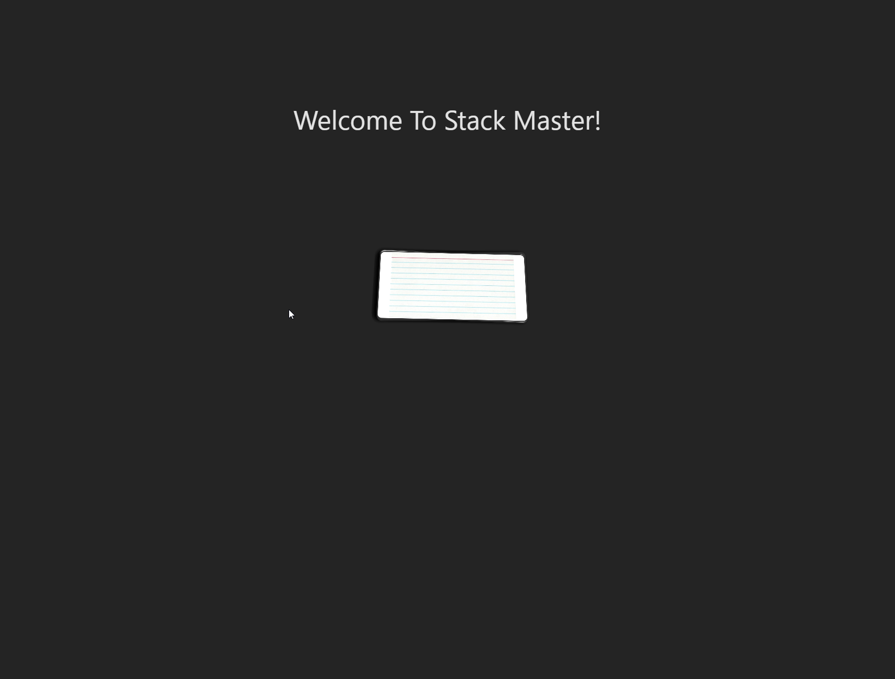

# Stack Master: A MERN Stack Single-Page Application

We’ve just finished our FullStack Bootcamp! But the life of a developer is never done. Now it’s time to:

- Review the lesson materials

- Practice, practice, practice

-Build something!

-Be proud of your new portfolio!

## Stack Master is here to help you review the class material and make sure that you have a reference point to come back to during your continuing studies

### Homepage Screenshot

## Project Requirements

As a group we used everything learned throughout this course to create a MERN stack single-page application that works with real-world data to solve a real-world challenge, with a focus on data and user demand. The project fulfills the following requirements:

* Use React for the front end.

* Use GraphQL with a Node.js and Express.js server.

* Use MongoDB and the Mongoose ODM for the database.

* Use queries and mutations for retrieving, adding, updating, and deleting data.

* Be deployed using Render (with data).

* Have a polished UI.

* Be responsive.

* Be interactive (i.e., accept and respond to user input).

* Include authentication (JWT).

* Protect sensitive API key information on the server.

* Have a clean repository that meets quality coding standards (file structure, naming conventions, best practices for class and id naming conventions, indentation, high-quality comments, etc.).

* Have a high-quality README
  
* As a bonus, we integrated STRIPE to support a donation button!

### CSS Styling

Instead of using a CSS library like Bootstrap, Stack Master was implemented with Tailwind and also uses a few different animaton methods.

### Payment Platform

Even though we didn't create an e-commerce application, we set up the site to accept charitable donations.

### Contributors

The team consisted of:

- @vpontual
- @Stewpra
- @garybright89
- @nahidahmed92

### License

    Licensed under the MIT License license.

